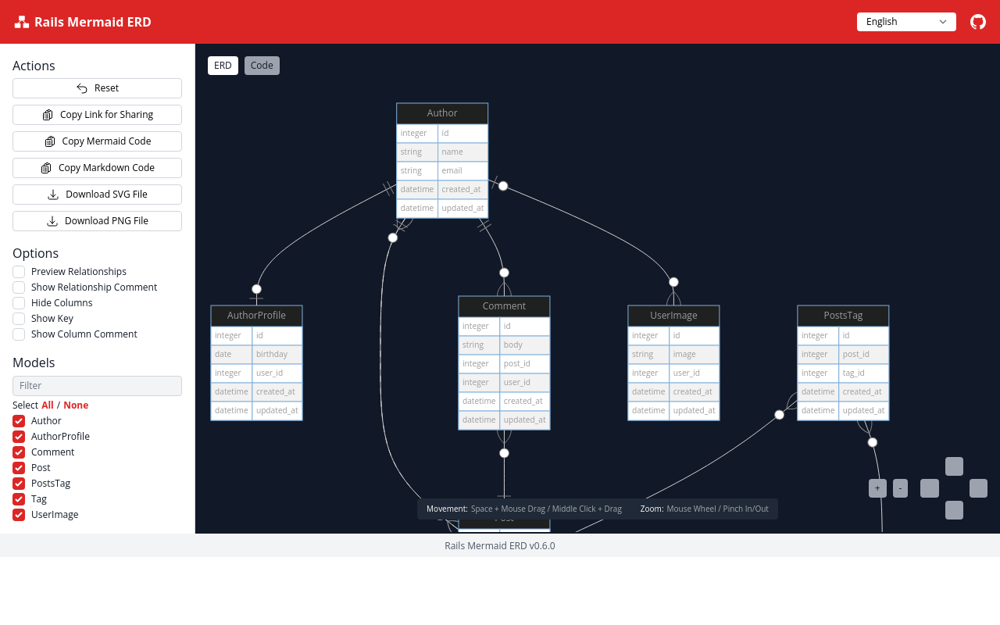

# Rails Mermaid ERD

[](https://github.com/koedame/rails-mermaid_erd/actions/workflows/run-test.yml)
[](https://rubygems.org/gems/rails-mermaid_erd)

Ruby on Railsアプリケーションから [Mermaid ERD](https://mermaid-js.github.io/mermaid/#/entityRelationshipDiagram) を生成します。

[](./docs/screen_shot.png)

[デモページ](https://koedame.github.io/rails-mermaid_erd/example.html)

ERDは自由自在に生成できます。
生成されたERDはMarkdown形式でコピーできるため、GitHubなどで簡単に共有できます。
画像として保存することもできるので、Mermaidが使えない環境でも使えます。
エディターはシングルHTMLファイルであるため、エディター本体を共有することも可能です。

## インストール手順

導入したいRailsアプリケーションのGemfileに以下の行を追加してください。

```ruby
gem "rails-mermaid_erd", group: :development
```

次に、以下のコマンドを実行してGemをインストールします。

```bash
$ bundle install
```

## 使い方

Rakeタスク `mermaid_erd` を実行すると `<app_root>/mermaid_erd/index.html` が生成されます。

```bash
$ bundle exec rails mermaid_erd
# or
$ bundle exec rake mermaid_erd
```

生成された `<app_root>/mermaid_erd/index.html` をお使いのブラウザで開くだけです。
このファイルをGit管理から除外したい場合は `.gitignore` に以下の行を追加してください。

```.gitignore
mermaid_erd
```

`<app_root>/mermaid_erd/index.html` はシングルHTMLファイルです。
このファイルを共有すれば、Ruby on Rails環境が無くても使用できます。サーバーにアップロードすれば、同じURLを共有することもできます。
CIと連携して生成から共有までを自動化するのはとても有効な手段です。

<!--
TODO:
## Contributing

Contribution directions go here.
-->

## ライセンス

The gem is available as open source under the terms of the [MIT License](https://opensource.org/licenses/MIT).
