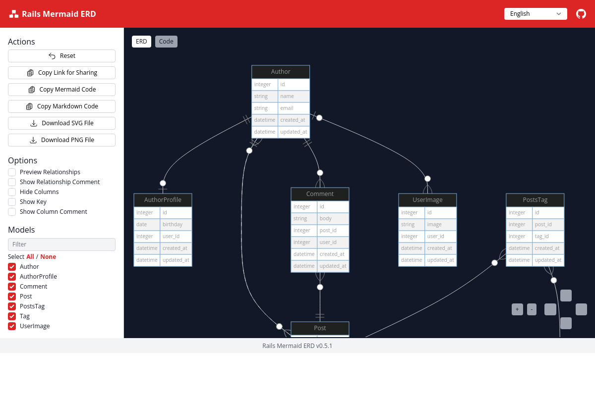

# Rails Mermaid ERD

[](https://github.com/koedame/rails-mermaid_erd/actions/workflows/run-test.yml)
[](https://rubygems.org/gems/rails-mermaid_erd)

Generate [Mermaid ERD](https://mermaid-js.github.io/mermaid/#/entityRelationshipDiagram) from your Ruby on Rails application.

[](./docs/screen_shot.png)

[Demo Page](https://koedame.github.io/rails-mermaid_erd/example.html)

Mermaid ERD can be generated at will.
The generated ERD can be copied in Markdown format, so they can be easily shared on GitHub.
You can also save it as an image, so it can be used in environments where Mermaid is not available.
The editor is a single HTML file, so the entire editor can be shared.

## Installation

Add this line to your application's Gemfile:

```ruby
gem "rails-mermaid_erd", group: :development
```

And then execute:

```bash
$ bundle install
```

## Usage

Run rake task `mermaid_erd` will generate `<app_root>/mermaid_erd/index.html`.

```bash
$ bundle exec rails mermaid_erd
# or
$ bundle exec rake mermaid_erd
```

Simply open the generated `<app_root>/mermaid_erd/index.html` in your browser.

This file is not required for Git management, so you can add it to `.gitignore` if necessary

```.gitignore
mermaid_erd
```

`<app_root>/mermaid_erd/index.html` is single HTML file.
If you share this file, it can be used by those who do not have Ruby on Rails environment. Or, you can upload the file to a web server and share it with the same URL.

It would be very smart to generate it automatically using CI.

<!--
TODO:
## Contributing

Contribution directions go here.
-->

## License
The gem is available as open source under the terms of the [MIT License](https://opensource.org/licenses/MIT).
