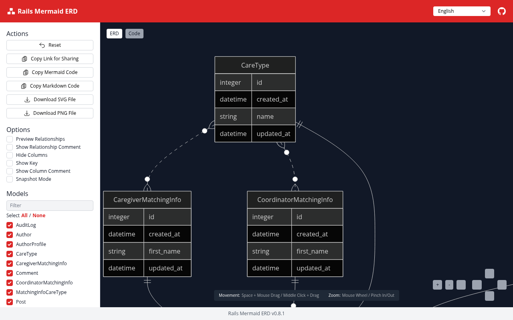

[English](./README.md) | [日本語](./README.ja.md)

# Rails Mermaid ERD

[](https://github.com/koedame/rails-mermaid_erd/actions/workflows/run-test.yml)
[](https://rubygems.org/gems/rails-mermaid_erd)

Generate [Mermaid ERD](https://mermaid-js.github.io/mermaid/#/entityRelationshipDiagram) from your Ruby on Rails application.

[](./docs/screen_shot.png)

[Demo Page](https://koedame.github.io/rails-mermaid_erd/example.html)

Mermaid ERD can be generated at will.
The generated ERD can be copied in Markdown format, so they can be easily shared on GitHub.
You can also save it as an image, so it can be used in environments where Mermaid is not available.
The editor is a single HTML file, so the entire editor can be shared.

## Installation

Add this line to your application's Gemfile:

```ruby
gem "rails-mermaid_erd", group: :development, require: false
```

And then execute:

```bash
$ bundle install
```

Add this line to your application's Rakefile:

```ruby
begin
  require "rails-mermaid_erd"
rescue LoadError
  # Do nothing.
end
```

## Usage

Run rake task `mermaid_erd` will generate `<app_root>/mermaid_erd/index.html`.

```bash
$ bundle exec rails mermaid_erd
# or
$ bundle exec rake mermaid_erd
```

Simply open the generated `<app_root>/mermaid_erd/index.html` in your browser.

This file is not required for Git management, so you can add it to `.gitignore` if necessary

```.gitignore
mermaid_erd
```

`<app_root>/mermaid_erd/index.html` is a single self-contained HTML file. All front-end dependencies (Tailwind, Mermaid, Vue) are inlined, so it works offline and behind strict corporate proxies — no CDN access is needed at view time. The file is roughly 4 MB because the bundles ship inside it.

If you share this file, it can be used by those who do not have a Ruby on Rails environment. Or, you can upload the file to a web server and share it with the same URL.

It would be very smart to generate it automatically using CI.

### Print the Mermaid source to stdout

Run rake task `mermaid_erd:print` to print the raw `erDiagram` source to stdout instead of writing the HTML viewer. This pipes cleanly into other tools:

```bash
$ bundle exec rails mermaid_erd:print
$ bundle exec rails mermaid_erd:print > er.mmd
$ bundle exec rails mermaid_erd:print | mmdc -i - -o er.svg
```

The output is the full diagram — every table, column, key, comment, and relation — equivalent to the HTML viewer with all of its detail toggles enabled.

## Supported versions

The Ruby × Rails combinations exercised by CI on every push and pull request:

| Rails | Ruby                             |
| ----- | -------------------------------- |
| 5.2   | 2.7                              |
| 6.0   | 2.7, 3.0                         |
| 6.1   | 2.7, 3.0, 3.1, 3.2               |
| 7.0   | 2.7, 3.0, 3.1, 3.2, 3.3          |
| 7.1   | 3.1, 3.2, 3.3, 3.4               |
| 7.2   | 3.1, 3.2, 3.3, 3.4               |
| 8.0   | 3.2, 3.3, 3.4, 4.0               |
| 8.1   | 3.2, 3.3, 3.4, 4.0               |

Other combinations may work but are not verified.

## Configuration

`./config/mermaid_erd.yml` to customize the configuration.
See [./docs/example.yml](./docs/example.yml) for an example configuration.

The setting items are as follows.

| key | description | default |
| --- | --- | --- |
| `result_path` | Destination of generated files. | `mermaid_erd/index.html` |
| `ignore_tables` | Array of regular-expression strings. Tables whose `table_name` matches any pattern are dropped from the generated ERD, along with any relations that point at them. Useful for excluding audit-log models, soft-deleted/legacy tables, or other large noise you don't want to render. Patterns are compiled with `Regexp.new`, so escape backslashes inside YAML strings (e.g. `"\\Aaudit_"`). | `[]` |

<!--
TODO:
## Contributing

Contribution directions go here.
-->

## License
The gem is available as open source under the terms of the [MIT License](https://opensource.org/licenses/MIT).
